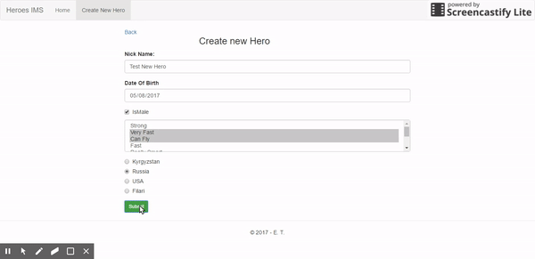

### Programming Task For Job 
##### *Position*: (.NET C# and JS Developer)

**Asignment description**  
>A programming task for candidates for Junior developer and technical engineer position. 
>
>1. Create an arbitrary form with bootstrap and vue.js, say, a contact or order form with at least five fields of different types: text, drop-down, date, radio, check box. 
>2. Add validation to the form fields. 
>3. Send a JSON-object with filled-in data to a REST-service on the submission: { fieldId1: 'value1', fieldId2: 'value2', ... } 
>4. Implement the REST-service using C# and ASP.NET Web Api that retrieves, saves, and returns data (JSON-objects) of forms. 
>5. Create a page for listing and searching the submitted objects. 
>6. Pack all JS- and CSS-files of the project into a single file and minify it with the help of Webpack.
>
>The key idea here that the form can be completely changed whereas the services will stay the same. We will evaluate the quality of your code and usability of the UI. If you're not able to implement one or more of the requirements, describe the reason and send us what you have done.

### Project Abstract Overview:
*Heroes IMS* (Information management system)
>Example project's purpose is to store basic information about heroes (Nickname, gender, country, powers)

### Project Techincal Overview
The main project consists of several parts: 
1. **Heroes.Data:** holds Data Transfer Objects and their mappings
2. **Heroes.DataAccessLayer:** contains entity objects, entity context, migrations, generic repository model and unit of work
3. **Heroes.BusinessLogicLayer:** contains services and their abstractions (+ Unit Tests)
4. **Heroes:** main Asp.NET Web Api (and also MVC) (REST API)
5. **Heroes/heroes-cli:** vuejs frontend part, built using typescript

**Overall overview of used stack:** *Asp.NET Web Api2*, *Entity Framework 6*, *Unity DI (Microsoft)*, *Automapper*, *SQL Server*,
*Vuejs2 (typescript)*, *webpack +(dev-server)*, *npm*, *bootstrap3*

#### Result screenshots
###### The page with the list of available heroes, with searching/filtering form

###### The page of creating a new hero

